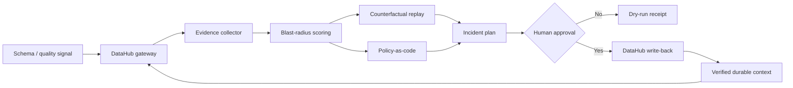

# Architecture

FAULTLINE is deliberately split at the catalog boundary. The incident engine knows
about assets, paths, signals, and governed mutations; it does not know whether the
graph came from a live DataHub instance or the deterministic judge fixture.

## Trust boundaries

| Boundary | Automatic | Approval required |
| --- | --- | --- |
| Entity, schema, lineage, owner, tag reads | Yes | No |
| Risk scoring and counterfactual simulation | Yes | No |
| Mutation payload construction | Yes | No |
| `add_tags` and `save_document` | No | Yes, immediately before execution |
| Downstream operational response | No | Not implemented or claimed |

FAULTLINE updates catalog context; it does not pretend that adding a tag has stopped
a deployment. The recommended operational action remains a recommendation until a
separate executor is explicitly integrated.

## Deterministic scoring

Each downstream path starts with a signal-specific base risk. Entity-type exposure,
criticality, production lifecycle, and confirmed column lineage add risk. Multi-hop
distance subtracts risk. Scores are clamped to `0..100`; thresholds in
`faultline.toml` map the highest score to observe, validate, retrain, quarantine, or
block.

The evidence ledger retains every contribution. This makes policy changes
reviewable and testable, and avoids fabricating an LLM explanation after a decision.

## DataHub MCP contract

The live adapter uses the official tool signatures current during development:

- `get_entities(urns=[...])`
- `get_lineage(urn=..., column=..., upstream=False, max_hops=..., max_results=...)`
- `add_tags(tag_urns=[...], entity_urns=[...])`
- `save_document(document_type="Analysis", title=..., content=..., related_assets=[...])`

The client lists available tools before every call. Missing reads fail the
investigation. Missing mutation tools fail closed and leave the dry-run plan intact.

## Degraded modes

- No DataHub configuration: run the exact same engine over the bundled fixture.
- Mutations disabled: preserve the proposal and downloadable receipt.
- A write fails: stop subsequent writes and report partial completion.
- No downstream lineage: choose `OBSERVE` with low confidence and write nothing
  unless a human later approves a record.
